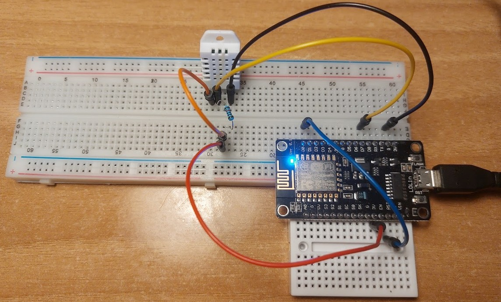
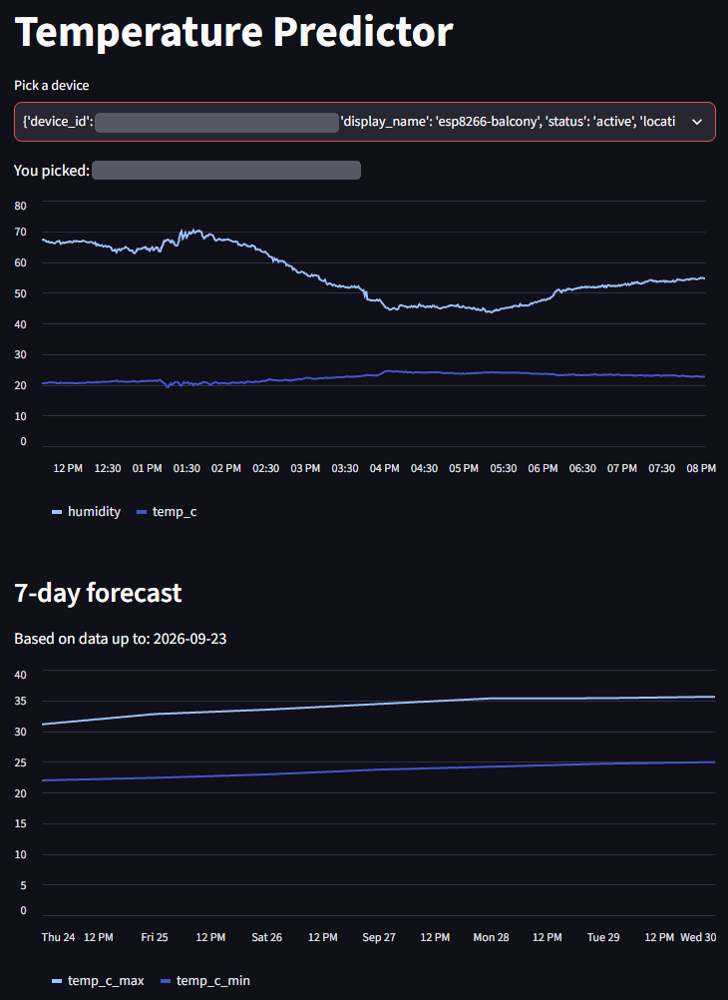
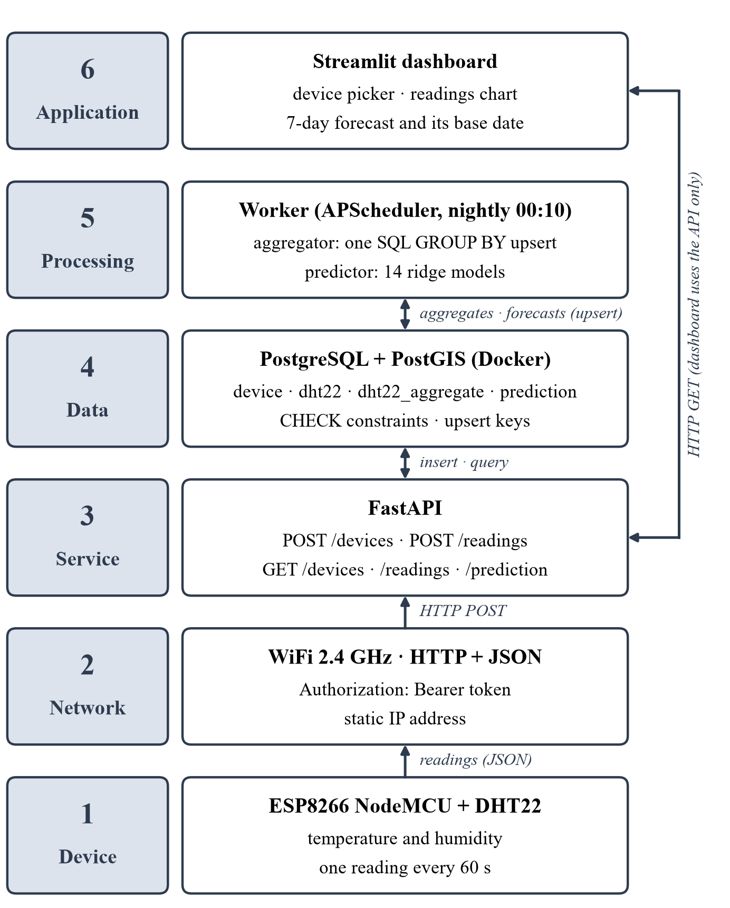

# 🌡️ Temperature Predictor

**A low-cost sensor on a balcony, a small data platform behind it, and a seven-day forecast of the daily maximum and minimum temperature for that exact spot.**


Weather services forecast for grid cells and airport stations, not for the balcony, garden or greenhouse where conditions are actually felt. Temperature Predictor measures temperature and humidity at one spot with an ESP8266 and a DHT22, stores every reading, and every night turns them into a local seven-day forecast.

<p align="center">
  
  &nbsp;
  
</p>

*Practical assignment by Konstantinos Giantselidis, Department of Information and Electronic Engineering, International Hellenic University.*

---

## ✨ What it does

- 📡 **Measures:** an ESP8266 NodeMCU reads a DHT22 every 60 s and posts the reading as JSON over WiFi.
- 🔐 **Authenticates:** each device has its own token, sent as `Authorization: Bearer …`. The server stores only its SHA-256 hash.
- 🗄️ **Stores:** PostgreSQL + PostGIS in Docker. Physical ranges are checked by the API *and* again by database `CHECK` constraints.
- 🧮 **Aggregates:** every night a worker turns each device's readings into daily maximum, minimum and mean values.
- 🔮 **Forecasts:** 14 ridge regression models predict the maximum and minimum temperature of each of the next 7 days. Forecasts are stored, so they can later be compared with what really happened.
- 📊 **Shows:** a Streamlit dashboard shows the latest readings and forecast, and reads everything through the API, never from the database.

## 🏗️ Architecture

The system is built as six layers. Each one is a separate program behind a narrow interface, so it can be changed or scaled on its own.

| # | Layer | Technology | Code |
|---|---|---|---|
| 6 | Application | Streamlit dashboard | [`dashboard/`](dashboard) |
| 5 | Processing | Worker: APScheduler, aggregator, predictor | [`worker/`](worker) |
| 4 | Data | PostgreSQL 18 + PostGIS in Docker | [`infra/`](infra) |
| 3 | Service | FastAPI, Pydantic, SQLAlchemy | [`api/`](api) |
| 2 | Network | 2.4 GHz WiFi, HTTP + JSON, bearer token | – |
| 1 | Device | ESP8266 NodeMCU + DHT22 | [`firmware/esp8266/`](firmware/esp8266) |

**A reading's journey:** sensor → `POST /readings` → `dht22` table → nightly aggregation into `dht22_aggregate` → 14 models → `prediction` table → `GET /prediction` → dashboard.

<p align="center">
  
</p>

## 📈 Forecasting model

- **Training data:** a new sensor has no history, so the models learn from decades of city weather: ERA5-Land reanalysis for Thessaloniki via Open-Meteo (one gap-free row per day since 1950). Training uses 1979–2024. The test set is 616 held-out days, January 2025 to September 2026.
- **Inputs:** only what the sensor itself measures: the day's maximum, minimum and mean temperature and humidity. A new sensor therefore gets its first forecast after **one complete day**.
- **Models:** 14 independent ridge regressions (α = 0.1), one per target (maximum/minimum × day 1–7). They're trained in [`notebooks/tinkering_data.ipynb`](notebooks/tinkering_data.ipynb) and saved to [`models/ridge_v1.joblib`](models).

**Mean absolute error (°C) on the test period**

| Day ahead | 1 | 2 | 3 | 4 | 5 | 6 | 7 |
|---|---|---|---|---|---|---|---|
| Maximum: ridge | **1.62** | **2.19** | **2.44** | **2.54** | **2.66** | **2.73** | **2.74** |
| Maximum: persistence | 1.66 | 2.34 | 2.65 | 2.77 | 2.89 | 3.00 | 3.06 |
| Minimum: ridge | **1.10** | **1.65** | **1.97** | **2.19** | **2.30** | **2.39** | **2.41** |
| Minimum: persistence | 1.38 | 1.89 | 2.23 | 2.39 | 2.60 | 2.75 | 2.82 |

The model beats persistence ("the future equals today") at every horizon. Climatology, the long-term average for the date, stays near 2.38 °C (max) and 2.16 °C (min), so it's still better from day 3 for the maximum and from day 4 for the minimum. The model sees today's weather but not the date, so day-of-year features are the next improvement.

## 🗂️ Repository layout

```
Temperature_Predictor/
├── api/                  FastAPI service: endpoints, schemas, ORM models, token auth
├── worker/               aggregator.py, predictor.py and the nightly scheduler.py
├── dashboard/            Streamlit app
├── firmware/esp8266/     Arduino sketch + secrets.example.h
├── infra/                docker-compose.yml and the database schema (db/init.sql)
├── data/                 raw ERA5-Land and NOAA daily data
├── models/               the trained ridge models (joblib)
├── notebooks/            data exploration and model training (+ the 2024 v1 notebooks)
├── report/               IEEE-style technical report and its figures
├── secrets/              db_password.txt.example
├── DECISIONS.md          every design decision, with reasons and rejected alternatives
└── .env.example
```

## 🚀 Getting started

**You need:** Docker Desktop, Python 3 (developed with 3.14), and, only for the sensor, the Arduino IDE 2 with the ESP8266 board package.

**1. Configure the secrets.** Neither file is committed.

```bash
cp .env.example .env                                         # database user, password and name
cp secrets/db_password.txt.example secrets/db_password.txt   # password for the database container
```

Use the **same password** in both: `.env` is read by the API and the worker, `secrets/db_password.txt` by the database container.

**2. Start the database.** On the first start, `infra/db/init.sql` creates the tables.

```bash
docker compose --env-file .env -f infra/docker-compose.yml up -d
```

**3. Install the Python packages.**

```bash
python -m venv .venv
.venv\Scripts\activate            # Linux/macOS: source .venv/bin/activate
pip install -r api/requirements.txt -r worker/requirements.txt -r dashboard/requirements.txt pandas scikit-learn joblib
```

**4. Run the API.** Interactive documentation is at <http://localhost:8000/docs>.

```bash
cd api
uvicorn main:app --host 0.0.0.0 --port 8000
```

`--host 0.0.0.0` lets the sensor reach the API over the local network. Allow TCP port 8000 through the PC's firewall.

**5. Register a sensor.** In `/docs`, call `POST /devices` with a `display_name`. The response contains the `device_id` and a **token that is shown only once**.

**6. Flash the sensor.**

- **Wiring:** DHT22 VCC → 3V3, DATA → D7, GND → GND, with a 10 kΩ pull-up resistor between VCC and DATA.
- **Arduino IDE:** board *NodeMCU 1.0 (ESP-12E Module)*, libraries *DHT sensor library* and *Adafruit Unified Sensor*.
- **Secrets:** copy `firmware/esp8266/secrets.example.h` to `secrets.h` (gitignored). Fill in the WiFi name and password (2.4 GHz), `API_URL` (`http://<pc-lan-ip>:8000/readings`), `DEVICE_ID` and `DEVICE_TOKEN`.
- **Network:** the sketch uses a static IP address (`localIP`, `gateway`, `subnet`). Adapt it to your network.
- **Upload:** the board then posts a reading every 60 s, and each accepted reading returns `201`.

**7. Run the worker** from inside `worker/`:

```bash
cd worker
python scheduler.py               # every night at 00:10 (Europe/Athens): aggregate, then predict
python aggregator.py              # ...or run the two steps once, by hand
python predictor.py
```

**8. Open the dashboard** at <http://localhost:8501>. The API must be running.

```bash
streamlit run dashboard/app.py
```

## 🔌 API

| Method | Path | What it does |
|---|---|---|
| `GET` | `/` | Welcome message (health check) |
| `POST` | `/devices` | Register a device; returns its ID and a one-time token |
| `POST` | `/readings` | Store a reading; needs `Authorization: Bearer <token>` |
| `GET` | `/devices` | List devices (token hashes are never returned) |
| `GET` | `/readings` | Newest readings; `?device_id=` and `?limit=` (1–1000, default 100) |
| `GET` | `/prediction` | Latest 7-day forecast for `?device_id=`, or an older one with `&based_on_date=` |

## 🧭 Design decisions

Every design choice is recorded in [`DECISIONS.md`](DECISIONS.md), from Docker and PostgreSQL to the token scheme, the training data and the forecast storage. Each one lists the reasons and the alternatives that were rejected, in the style of architecture decision records.

## 🚧 Limitations and future work

- **Security:** tokens travel over plain HTTP and device registration is open, so this only suits a private network. TLS and authenticated registration come next.
- **Deployment:** only the database runs in Docker, and the scheduler runs in a terminal. Every service should get its own container with a restart policy.
- **Data quality:** incomplete sensor days are not rejected yet. The aggregator groups readings by UTC date while training uses Athens days, so the forecast lags by one day.
- **Model:** add day-of-year features, cross-validation and feature selection, and calibrate the sensor against a reference.

## 📄 Technical report

The IEEE-style technical report is in [`report/`](report): the requirements, the six layers, the evaluation and a critical assessment of scalability and commercial use.

## 📚 Data sources

- **Training data:** daily ERA5-Land reanalysis for Thessaloniki (1950 onwards) from the
  Open-Meteo Historical Weather API, stored in `data/thessaloniki_openmeteo_raw.csv`.
  Weather data by [Open-Meteo.com](https://open-meteo.com/), licensed under
  [CC BY 4.0](https://creativecommons.org/licenses/by/4.0/).
- **ERA5-Land:** Muñoz Sabater, J. (2019): ERA5-Land hourly data from 1950 to present.
  Copernicus Climate Change Service (C3S) Climate Data Store (CDS). DOI: 10.24381/cds.e2161bac.
  Contains modified Copernicus Climate Change Service information 2026.
- **Earlier (v1) data:** NOAA GHCN-Daily, station MAKEDONIA, GR (`data/thessaloniki_weather_raw.csv`).
  Menne, M.J., et al. (2012): Global Historical Climatology Network - Daily (GHCN-Daily),
  Version 3. NOAA National Climatic Data Center. doi:10.7289/V5D21VHZ.
  32.5 % of its daily maxima and 41.4 % of its minima are missing, which is why version 2 switched to reanalysis.

## 📝 License

Released under the MIT License. See [`LICENSE`](LICENSE).
